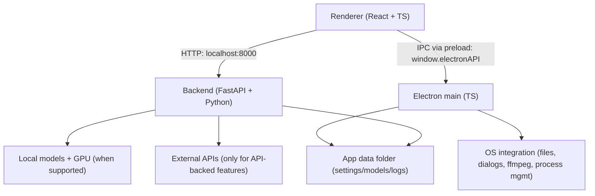

# LTX Desktop

LTX Desktop is an open-source desktop app for generating videos with LTX models — locally on supported Windows/Linux NVIDIA GPUs or Apple Silicon Macs, with an API mode for unsupported hardware. Local generation defaults to **LTX 2.5 Fast**; **LTX 2.3 Fast** remains available. **LTX 2.5 Pro** is API-only.

> **Status: Beta.** Expect breaking changes.
> Frontend architecture is under active refactor; large UI PRs may be declined for now (see [`CONTRIBUTING.md`](docs/CONTRIBUTING.md)).

<p align="center">
  
</p>

<p align="center">
  
</p>

<p align="center">
  
</p>

## Features

- Text-to-video generation
- Image-to-video generation
- Audio-to-video generation
- Video edit generation (Retake) — local **LTX 2.3 Fast**, or Pro on the API
- Text-to-image generation
- Image editing (image-to-image)
- Local **LTX 2.5 Fast** generation (default); switch to **LTX 2.3 Fast** in Settings
- LoRA support for local video generation
- Catalog-aware prompt enhancement (video, image generation, and image editing) — local or via the Gemini API
- Video Editor Interface
- Video Editing Projects

## Local vs API mode

| Platform / hardware | Generation mode | Notes |
| --- | --- | --- |
| Windows + CUDA GPU with **≥16GB VRAM** | Local generation | Downloads model weights locally |
| Windows (no CUDA, <16GB VRAM, or unknown VRAM) | API-only | **LTX API key required** |
| Linux + CUDA GPU with **≥16GB VRAM** | Local generation | Downloads model weights locally |
| Linux (no CUDA, <16GB VRAM, or unknown VRAM) | API-only | **LTX API key required** |
| macOS, Apple Silicon with **≥15GB free RAM** | Local generation | Downloads model weights locally; runs on MPS |
| macOS, Apple Silicon with <15GB free RAM, or Intel Mac | API-only | **LTX API key required** |

In API-only mode, available resolutions/durations may be limited to what the API supports. The API path also offers **LTX 2.5 Fast**, **LTX 2.5 Pro**, and 2.3 Fast/Pro.

### Local models

| Model | Where | Notes |
| --- | --- | --- |
| **LTX 2.5 Fast** | Local (default) and API | t2v / i2v / a2v, IC-LoRA, user LoRAs. No local Retake or Extend. |
| **LTX 2.3 Fast** | Local and API | Full local feature set, including Retake and Extend. |
| **LTX 2.5 Pro** / **2.3 Pro** | API only | Paid cloud generation. |

Switch the active local checkpoint in **Settings > Models**. Newer weights (including 2.5) are gated on Hugging Face — sign in and accept the license before downloading.

## System requirements

### Windows (local generation)

- Windows 10/11 (x64)
- NVIDIA GPU with CUDA support and **≥16GB VRAM** (more is better)
- 16GB+ RAM (32GB recommended)
- **160GB+ free disk space** (for model weights, Python environment, and outputs)

### Linux (local generation)

- Ubuntu 22.04+ or similar distro (x64 or arm64)
- NVIDIA GPU with CUDA support and **≥16GB VRAM** (more is better)
- NVIDIA driver installed (PyTorch bundles the CUDA runtime)
- 16GB+ RAM (32GB recommended)
- Plenty of free disk space for model weights and outputs

### macOS (local generation)

- Apple Silicon (arm64) — Intel Macs have no MPS backend and stay in API-only mode
- macOS 13+ (Ventura)
- **≥15GB free RAM** (not total — the OS/Electron/app already use some); more avoids weight streaming from disk
- Plenty of free disk space for model weights and outputs

Below the free-RAM floor, or on an Intel Mac, the app falls back to API-only mode instead — same as underpowered Windows/Linux hardware (see the table above). API-only mode just needs a stable internet connection.

**How the RAM check works.** The app checks *free* RAM — not total — and only **once**, at launch (when the Python backend process starts). It is not re-checked while the app is running. If other apps are using memory at that moment, you can land in API-only mode even on a capable Mac.

If you have 32GB+ of total RAM but still see API-only mode: close memory-heavy apps (browsers are usually the biggest offender), then **quit and relaunch LTX Desktop** — freeing memory while the app is already open has no effect, since the check doesn't run again until the next launch.

## Install

1. Download the latest installer from GitHub Releases: [Releases](../../releases)
2. Install and launch **LTX Desktop**
3. Complete first-run setup (Hugging Face sign-in may be required to download gated 2.5 weights)

Packaged installs check GitHub Releases for updates and apply them when you quit the app.

## First run & data locations

LTX Desktop stores app data (settings, models, logs) in:

- **Windows:** `%LOCALAPPDATA%\LTXDesktop\`
- **macOS:** `~/Library/Application Support/LTXDesktop/`
- **Linux:** `$XDG_DATA_HOME/LTXDesktop/` (default: `~/.local/share/LTXDesktop/`)

Model weights are downloaded into the `models/` subfolder (this can be large and may take time).

On first launch you may be prompted to sign in to Hugging Face and accept model license terms (2.5 weights are gated; license text is fetched from Hugging Face). Requires internet.

Text encoding: to generate videos you must configure text encoding:

- **LTX API key** (cloud text encoding) — **text encoding via the API is completely FREE** and highly recommended to speed up inference and save memory. Generate a free API key at the [LTX Console](https://console.ltx.video/). [Read more](https://ltx.io/model/model-blog/ltx-2-better-control-for-real-workflows).
- **Local Text Encoder** (extra download; enables fully-local operation on supported hardware) — if you don't wish to generate an API key, you can encode text locally via the settings menu.

## LoRA/IC-LoRA Library

LoRA adapters let you steer **local** video generation toward a specific style or subject. They apply to local generation (Windows/Linux NVIDIA hardware or Apple Silicon Macs), for text-to-video, image-to-video, and audio-to-video — not in API/cloud mode.

In local mode, **Browse LoRAs** (styles/subjects for text/image/audio-to-video) and **Browse IC-LoRAs** (in-context effects, e.g. video-to-video) open a built-in library of ready-to-download LoRAs — no manual file placement needed. Each entry shows a preview, its instructions, and a link to its Hugging Face page; some gated models require signing in with Hugging Face first. Entries authored by **LTX** are official; everything else is community-contributed and flagged with a disclaimer that LTX doesn't endorse or take responsibility for it.

### Custom LoRAs

You can also use your own `.safetensors` LoRA files instead of (or alongside) the library.

**Which LoRAs are supported.** Local generation uses **LTX‑2.5 Fast** or **LTX‑2.3 Fast** (both 22B distilled). Catalog entries list the models they support (typically both). LoRAs labeled **LTX‑2**, **LTX‑2.3**, or **LTX‑2.5** target this family and are supported. This includes LoRAs exported from ComfyUI for LTX‑Video (their key names are remapped automatically). A LoRA whose tensors don't match the active model is simply skipped, so it has no effect rather than producing an error. LoRAs built for other base models (e.g. SDXL, Wan, Hunyuan, or older LTXV 0.9.x) target a different architecture and will not take effect.

**Where to put the files.** Library downloads land in their own subfolder under `loras/` (one per LoRA), so it's safe to drop your own `.safetensors` files straight into the `loras/` (or `lora/`) subfolder of your models folder:

```
models/
└── loras/
    ├── cinematic.safetensors
    ├── claymation.safetensors
    └── <lora-id>/              ← library download, one subfolder per LoRA
        └── model.safetensors
```

> **Use the `loras/` subfolder.** A file is detected as a LoRA only if it lives in a folder named `loras`/`lora` **or** its filename contains `lora` — and many LoRAs aren't named that way. Dropping them straight into `loras/` is the reliable option; it won't collide with library downloads, which each get their own subfolder. Subfolders are scanned recursively, so further nesting is fine.

Your models folder is the location you chose during setup, or the default for your platform:

- **Windows:** `%LOCALAPPDATA%\LTXDesktop\models\`
- **macOS:** `~/Library/Application Support/LTXDesktop/models/`
- **Linux:** `$XDG_DATA_HOME/LTXDesktop/models/` (default: `~/.local/share/LTXDesktop/models/`)

**When the LoRA button appears.** In the generation view, a **LoRA** selector appears next to the other video settings (FPS, aspect ratio) only when **all** of these are true:

1. You're in **Video** generation mode (not Image, Retake, or IC‑LoRA).
2. You're generating **locally** — not in API/cloud generation mode.
3. **At least one** LoRA file is detected in the models folder.

Open the selector to tick one or more LoRAs and adjust each one's strength. If you added files while the app was already open, reopen the generation view (or restart the app) — the installed‑LoRA list is read on load.

## API keys, cost, and privacy

### LTX API key

The LTX API is used for:

- **Cloud text encoding and prompt enhancement** — **FREE**; text encoding is highly recommended to speed up inference and save memory
- API-based video generations (required on unsupported hardware; optional Fast/Pro cloud generations including **LTX 2.5**) — paid
- Retake — paid

An LTX API key is required in API-only mode, but optional for local generation if you enable the Local Text Encoder.

Generate a FREE API key at the [LTX Console](https://console.ltx.video/). Text encoding is free; video generation API usage is paid. [Read more](https://ltx.io/model/model-blog/ltx-2-better-control-for-real-workflows).

When you use API-backed features, prompts and media inputs are sent to the API service. Your API key is stored locally in your app data folder — treat it like a secret.

### fal API key (optional)

Used for Z Image Turbo text-to-image generation and image editing (image-to-image) in API mode. When enabled, image generation/editing requests are sent to fal.ai. You can also opt into API-based image generation from **Settings > General > Images Generation** even on hardware that supports local generation.

Create an API key in the [fal dashboard](https://fal.ai/dashboard/keys).

### Gemini API key (optional)

Used when Gemini is the selected Agent provider. Timeline gap-fill suggestions and the **Enhance (API)** prompt button use whichever Agent LLM is selected in Settings (API key or Connect), not Gemini only. Local Enhance still uses the on-device Gemma text encoder. When Gemini is selected, prompt context and frames/reference images may be sent to Google Gemini.

## Architecture

LTX Desktop is split into three main layers:

- **Renderer (`frontend/`)**: TypeScript + React UI.
  - Calls the local backend over HTTP at `http://localhost:8000`.
  - Talks to Electron via the preload bridge (`window.electronAPI`).
- **Electron (`electron/`)**: TypeScript main process + preload.
  - Owns app lifecycle and OS integration (file dialogs, native export via ffmpeg, starting/managing the Python backend).
  - Security: renderer is sandboxed (`contextIsolation: true`, `nodeIntegration: false`).
- **Backend (`backend/`)**: Python + FastAPI local server.
  - Orchestrates generation, model downloads, and GPU execution.
  - Calls external APIs only when API-backed features are used.



## Development (quickstart)

Prereqs:

- Node.js
- `uv` (Python package manager)
- Python 3.13+
- Git

Setup:

```bash
pnpm setup:dev
```

Run:

```bash
pnpm dev
```

Debug:

```bash
pnpm dev:debug
```

`dev:debug` starts Electron with inspector enabled and starts the Python backend with `debugpy`.

Typecheck:

```bash
pnpm typecheck
```

Backend tests:

```bash
pnpm backend:test
```

Performance & validation:

```bash
pnpm perf:dev
```

Starts the backend headless and opens the performance runner dashboard — soak/leak
tests, cold-start latency, VRAM-fit-per-GPU, output-integrity, and a full
feature-surface sanity sweep, all against the same backend the app ships. See
[`backend/performance_runner/README.md`](backend/performance_runner/README.md).

Building installers:
- See [`INSTALLER.md`](docs/INSTALLER.md)

## Telemetry

LTX Desktop collects minimal, anonymous usage analytics (app version, platform, and a random installation ID) to help prioritize development. No personal information or generated content is collected. Analytics is enabled by default and can be disabled in **Settings > General > Anonymous Analytics**. See [`TELEMETRY.md`](docs/TELEMETRY.md) for details.

## Docs

- [`INSTALLER.md`](docs/INSTALLER.md) — building installers
- [`TELEMETRY.md`](docs/TELEMETRY.md) — telemetry and privacy
- [`backend/architecture.md`](backend/architecture.md) — backend architecture
- [`backend/performance_runner/README.md`](backend/performance_runner/README.md) — performance & validation harness

## Changelog

Release notes live on the [GitHub releases page](https://github.com/Lightricks/LTX-Desktop/releases).

## Contributing

See [`CONTRIBUTING.md`](docs/CONTRIBUTING.md).

## License

Apache-2.0 — see [`LICENSE.txt`](LICENSE.txt).

Third-party notices (including model licenses/terms): [`NOTICES.md`](NOTICES.md).

Model weights are downloaded separately and may be governed by additional licenses/terms.
